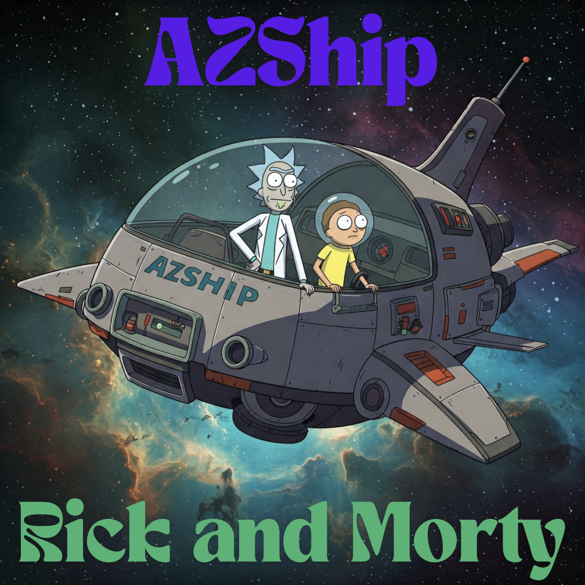

# Desafio AZShip - Rick and Morty

Aplicativo mobile desenvolvido como parte do desafio da AZShip, utilizando a API Rick and Morty para exibir informações sobre episódios e personagens da série.



## Tecnologias Utilizadas

- **React Native / Expo**: Framework para desenvolvimento mobile
- **TypeScript**: Superset de JavaScript com tipagem estática
- **Apollo Client**: Cliente GraphQL para consumo da API
- **Expo Router**: Sistema de roteamento baseado em arquivos
- **React Navigation**: Navegação entre telas
- **Expo Vector Icons**: Biblioteca de ícones

## Funcionalidades Implementadas

### Episódios

- **Listar todos os episódios**:
  - Número do episódio
  - Nome
  - Data em que foi ao ar
  - Botão para favoritar/desfavoritar

- **Detalhes do episódio**:
  - Número do episódio
  - Nome
  - Data em que foi ao ar
  - Lista de personagens que aparecem no episódio

- **Busca de episódios**:
  - Busca por nome do episódio
  - Exibição de resultados em tempo real

### Personagens

- **Listar todos os personagens**:
  - Nome
  - Status (vivo, morto, desconhecido)
  - Espécie
  - Origem
  - Localização atual
  - Imagem do personagem

- **Paginação infinita**:
  - Carregamento automático de mais personagens ao rolar a tela

### Favoritos

- **Favoritar/Desfavoritar episódios**:
  - Marcar episódios como favoritos
  - Botão de favorito em cada card de episódio

- **Lista de favoritos**:
  - Visualização de todos os episódios marcados como favoritos
  - Remoção de favoritos diretamente da lista

## API Utilizada

O aplicativo consome a API GraphQL Rick and Morty, disponível em:
```
https://rickandmortyapi.com/graphql
```

Esta API fornece dados completos sobre:
- Episódios da série
- Personagens
- Localizações

## Estrutura do Projeto

- **/app**: Telas e rotas da aplicação (usando Expo Router)
- **/components**: Componentes reutilizáveis
- **/services**: Configuração do Apollo Client e queries GraphQL
- **/types**: Tipagens TypeScript para a API
- **/assets**: Imagens e recursos estáticos

## Funcionalidades Adicionais

- **Splash Screen personalizada**
- **Tema escuro** para melhor experiência visual
- **Cards com estilo único** para episódios e personagens
- **Interface responsiva** adaptada para diferentes tamanhos de tela

## Como Executar o Projeto

1. Clone o repositório
2. Instale as dependências:
```bash
npm install
```
3. Inicie o servidor de desenvolvimento:
```bash
npm start
```
4. Escaneie o QR Code com o aplicativo Expo Go ou execute em um emulador.

## Desenvolvido por

@ marcelo guimaraes
